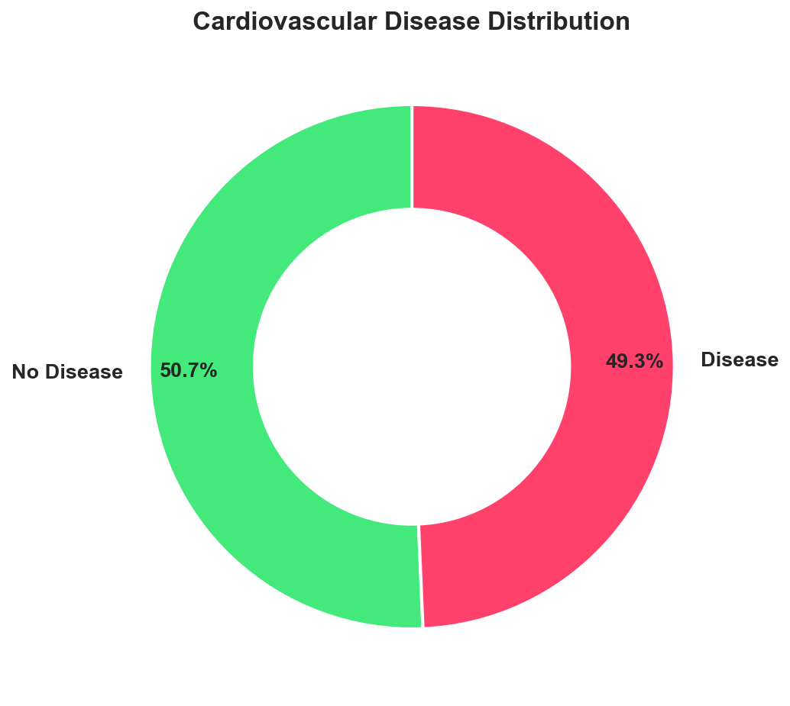
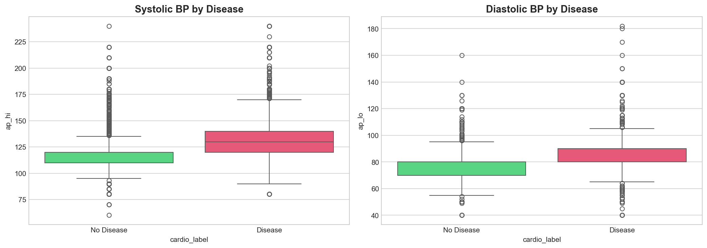
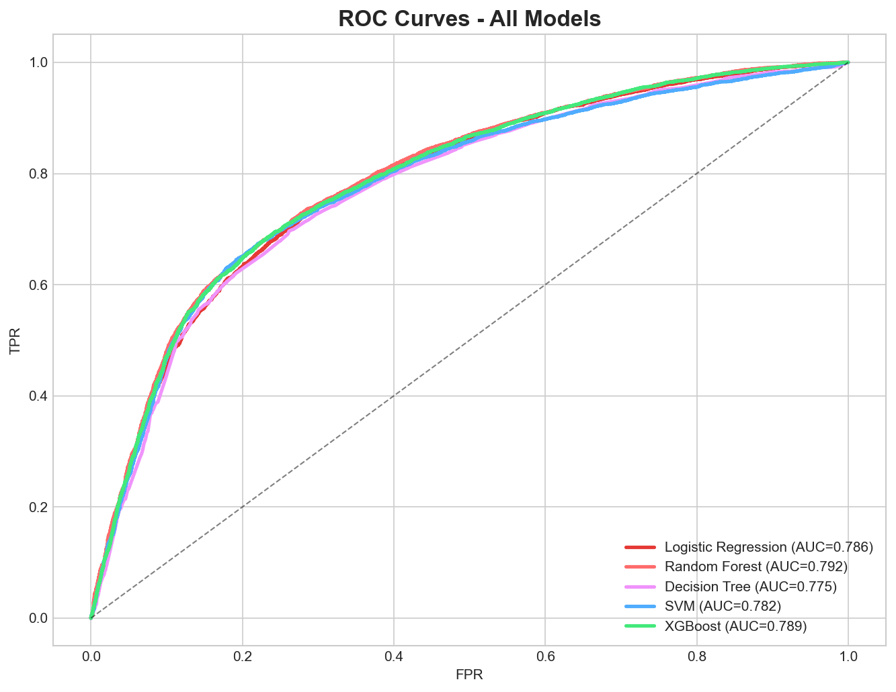
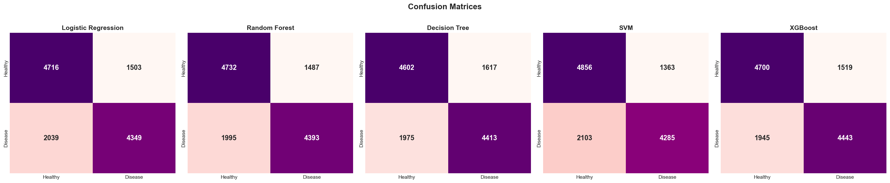
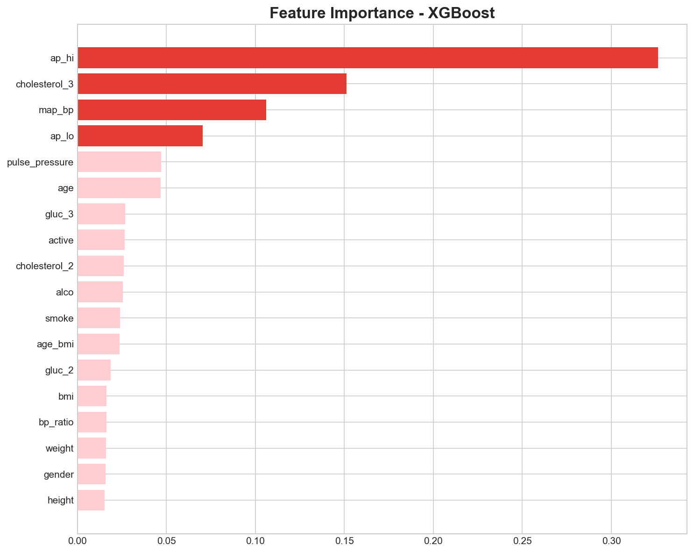

# ❤️ Heart Disease Prediction Using Patient Health Data

Predict cardiovascular disease in patients using clinical health metrics and lifestyle data.
This end-to-end ML project uses the **Cardiovascular Disease Dataset (70,000 records)**, applies data cleaning and feature engineering (BMI, MAP, Pulse Pressure), trains XGBoost and Random Forest models (alongside LR, SVM, Decision Tree), and evaluates model performance with ROC-AUC and F1-Score.
The dashboard outputs actionable health insights backed by model predictions.


## Team Members
- Ananthanarayanan B
- Lanka Priya
- Anagha Jayarajan

## Project Overview

Heart disease is the leading cause of death worldwide, accounting for over 17 million deaths annually.
This project builds a Machine Learning pipeline to:

- **Analyze** patient health data and identify cardiovascular risk factors
- **Predict** whether a patient has cardiovascular disease
- **Visualize** insights through an interactive Streamlit dashboard
- **Recommend** lifestyle changes and medical recommendations based on risk scores

### Dataset

- **Source:** [Cardiovascular Disease Dataset (Kaggle)](https://www.kaggle.com/datasets/sulianova/cardiovascular-disease-dataset)
- **Records:** 70,000 patients
- **Features:** 11 clinical features + 1 target
- **Target:** Cardiovascular Disease (1 = Disease, 0 = No Disease) — ~50% balanced

## Exploratory Data Analysis (EDA)

- **Blood Pressure**: Higher systolic BP is the strongest predictor of cardiovascular disease.
- **BMI & Weight**: Patients with higher BMI show significantly elevated disease risk.
- **Cholesterol**: Patients with "Well Above Normal" cholesterol have nearly 2x higher disease rates.
- **Age**: Older patients (55+) have significantly higher cardiovascular risk.
- **Physical Activity**: Active patients show lower disease prevalence.

## Data Challenges

- **Outlier Removal**: Physiologically impossible BP values (systolic < 60 or > 250, diastolic < 40 or > 200) needed to be filtered.
- **Age Conversion**: Age was stored in days and required conversion to years.
- **Height/Weight Extremes**: Extreme values outside the 1st–99th percentile range were removed.
- **Feature Engineering**: Derived medical features (BMI, Pulse Pressure, MAP) required domain knowledge.

## Models Used

| Model | Description |
|-------|-------------|
| Logistic Regression | Baseline linear model |
| Random Forest | Ensemble of decision trees |
| Decision Tree | Single tree classifier with pruning |
| XGBoost | Gradient boosted decision trees |
| SVM | Support vector machine with RBF kernel |

### Feature Engineering
- `bmi` — Body Mass Index (weight / height²)
- `pulse_pressure` — Systolic − Diastolic BP
- `map_bp` — Mean Arterial Pressure
- `bp_ratio` — Systolic / Diastolic ratio
- `age_bmi` — Age × BMI interaction

### Evaluation Metrics
- Accuracy, Precision, Recall, F1-Score, ROC-AUC
- Confusion Matrix, ROC Curve, Feature Importance

## Results

The models were evaluated using ROC-AUC, F1-Score, and Recall to identify the best predictor of cardiovascular disease.

| Model | Accuracy | Precision | Recall | F1-Score | ROC-AUC |
|---|---|---|---|---|---|
| **XGBoost ⭐** | **0.7252** | **0.7452** | **0.6955** | **0.7195** | **0.7893** |
| Random Forest | 0.7238 | 0.7471 | 0.6877 | 0.7162 | 0.7923 |
| SVM | 0.7251 | 0.7587 | 0.6708 | 0.7120 | 0.7817 |
| Logistic Regression | 0.7190 | 0.7432 | 0.6808 | 0.7106 | 0.7856 |
| Decision Tree | 0.7151 | 0.7318 | 0.6908 | 0.7107 | 0.7754 |

> **XGBoost selected as best model** due to its superior F1-Score and strong balance of precision and recall on 63,000+ patient records.

## Streamlit Dashboard

The interactive web application includes **4 pages**:

1. **🏠 Overview** — KPI cards, disease distribution, cholesterol analysis, key medical insights
2. **📊 Exploratory Analysis** — Interactive charts, categorical/numerical analysis, correlation heatmaps
3. **❤️ Predict Disease** — Real-time prediction with BMI calculator and risk gauge
4. **📈 Model Performance** — Metrics comparison, ROC curves, confusion matrices, feature importance

Link: [**Heart Disease Predictor App**](https://your-app-name.streamlit.app/)

---

### Dashboard Screenshots











## Key Findings

- **Systolic blood pressure** is the strongest predictor of cardiovascular disease
- **Higher BMI** correlates with elevated disease risk
- **Cholesterol "Well Above Normal"** nearly doubles disease rates
- **Age** — older patients have significantly higher risk
- **Physical activity** provides protective effects
- The dataset is well-balanced (~50/50 split), so SMOTE was not needed

## Data Science Life Cycle Coverage

| Stage | Files / Process |
|---|---|
| Data Understanding | `heart_disease_analysis.ipynb` |
| Preprocessing | `src/data_preprocessing.py` |
| Feature Engineering | `bmi`, `pulse_pressure`, `map_bp`, `bp_ratio`, `age_bmi` |
| Modeling | XGBoost, Random Forest, Decision Tree, LR, SVM |
| Evaluation | ROC-AUC, F1, Confusion Matrix |
| Deployment | Streamlit Cloud |

## Project Structure

```
├── data/
│   └── heart.csv                         # Cardiovascular Disease dataset (70K)
├── notebooks/
│   ├── heart_disease_analysis.ipynb      # Full EDA + Modeling notebook
│   └── heart_disease_analysis.py         # Script version
├── models/
│   ├── best_model.pkl                    # Trained best model (XGBoost)
│   ├── preprocessor.pkl                  # Fitted StandardScaler
│   ├── model_metadata.pkl                # Feature names & metrics
│   ├── all_results.pkl                   # All model results
│   └── *.png                             # EDA and evaluation plots
├── src/
│   ├── __init__.py
│   ├── data_preprocessing.py             # Data cleaning & feature engineering
│   ├── model_training.py                 # Model training pipeline
│   └── utils.py                          # Visualization helpers
├── app.py                                # Streamlit web application
├── requirements.txt                      # Python dependencies
├── README.md                             # Project documentation
└── .gitignore                            # Git ignore rules
```

## Quick Start

### 1. Clone the Repository
```bash
git clone https://github.com/YOUR_USERNAME/heart-disease-prediction.git
cd heart-disease-prediction
```

### 2. Install Dependencies
```bash
pip install -r requirements.txt
```

### 3. Train the Model
```bash
python -m src.model_training
```

### 4. Launch the Dashboard
```bash
streamlit run app.py
```

## Technologies

- **Python 3.8+**
- **Pandas, NumPy** — Data manipulation
- **Scikit-learn** — Model training & evaluation
- **XGBoost** — Gradient boosted decision trees
- **Plotly** — Interactive visualizations
- **Streamlit** — Web application framework
- **Matplotlib, Seaborn** — Static visualizations
- **Joblib** — Model serialization

## License

This project is developed as a capstone project for Predictive Analytics coursework (AY 2025-2027)
